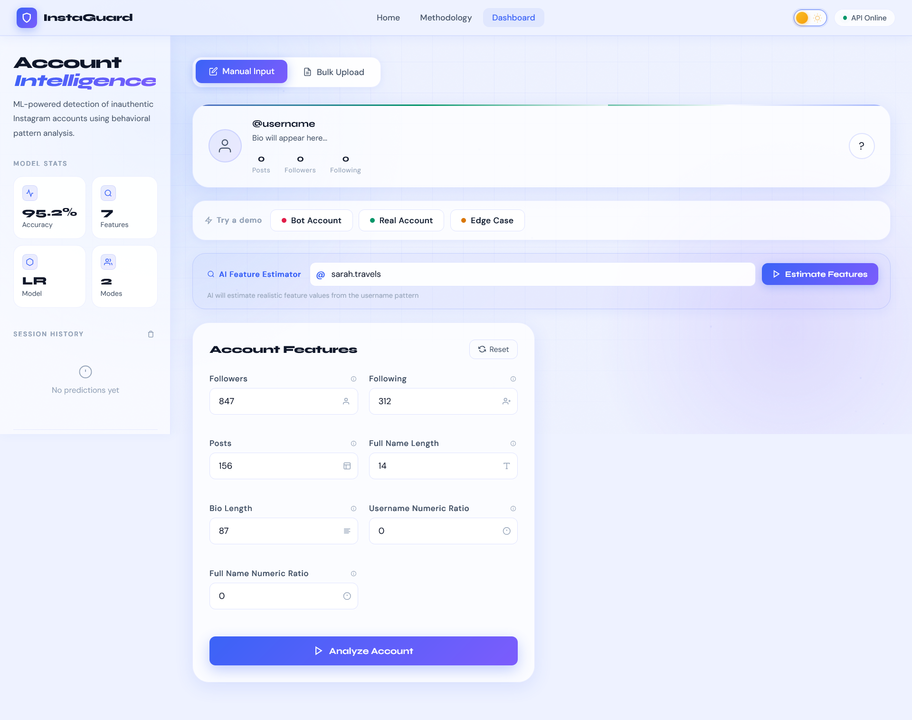
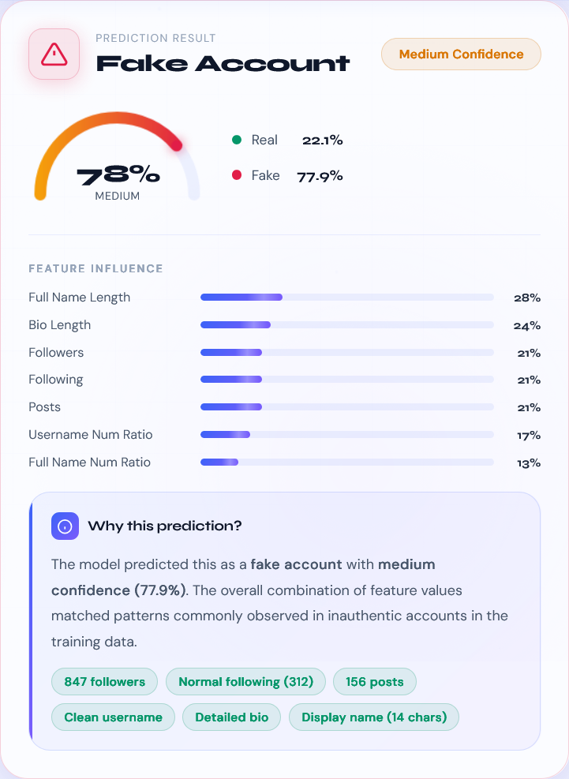

# 🛡️ InstaGuard — Fake Account Detection System


An AI-powered full-stack web application that detects fake Instagram accounts using machine learning and behavioral analysis.

🔗 **Live API:** https://instafake-backend-4tmw.onrender.com/
🔗 **Repository:** https://github.com/Aakarsh85/InstaFake

---

## 🚀 Overview

InstaGuard is an end-to-end machine learning system that classifies social media accounts as **Real** or **Fake** based on profile features like followers, engagement, and username patterns.

It combines:

* A trained ML model
* A Flask backend API
* A modern interactive frontend dashboard

---

## 📸 Screenshots

> *(Add these images after uploading to GitHub — keep names like below)*

### 🔹 Dashboard



### 🔹 Prediction Result



### 🔹 Bulk Analysis


---

## 🔄 Project Flow (How it Works)

```text
User Input (Frontend)
        ↓
Feature Validation & UI Processing
        ↓
API Request (/predict)
        ↓
Flask Backend
        ↓
Data Preprocessing
        ↓
ML Model Prediction
        ↓
Confidence + Probability Calculation
        ↓
Response to Frontend
        ↓
Result Visualization (UI Dashboard)
```

---

## ✨ Features

* 🤖 Machine Learning–based Fake Account Detection
* 🔍 Real-time Single Account Prediction
* 📊 Bulk Account Analysis Support
* 🧠 AI Username Feature Estimator
* 📈 Confidence Score + Probability Breakdown
* 🌙 Dark / Light Mode Toggle
* 🧾 Session History Tracking
* 🎨 Modern Glassmorphism UI with animations
* ⚡ REST API with health monitoring

---

## 📁 Folder Structure

```text
InstaFake/
├── backend/
│   └── app.py                # Flask API
├── frontend/
│   ├── index.html            # Dashboard
│   ├── script.js             # API + logic
│   ├── style.css             # UI design
│   ├── landing.html
│   └── methodology.html
├── model/
│   ├── best_model.pkl
│   └── model_reg.pkl
├── training/
├── data/
├── requirements.txt
└── README.md
```

---

## 🛠️ Tech Stack

| Layer      | Technology            |
| ---------- | --------------------- |
| Backend    | Flask (Python)        |
| ML Model   | Scikit-learn          |
| Data       | Pandas, NumPy         |
| Frontend   | HTML, CSS, JavaScript |
| Deployment | Render + Gunicorn     |

---

## ⚙️ Local Setup

### 1️⃣ Clone the repository

```bash
git clone https://github.com/Aakarsh85/InstaFake.git
cd InstaFake
```

### 2️⃣ Setup Backend

```bash
cd backend

python -m venv venv

# Activate
venv\Scripts\activate        # Windows
source venv/bin/activate     # Mac/Linux

pip install -r ../requirements.txt

python app.py
```

👉 Runs on:

```
http://localhost:10000
```

---

### 3️⃣ Run Frontend

```bash
cd frontend
python -m http.server 8080
```

👉 Open:

```
http://localhost:8080
```

> ⚠️ Update `API_BASE` in `script.js` to `http://localhost:10000` when running locally.

---

## 🔌 API Endpoints

### `GET /health`

```json
{
  "success": true,
  "status": "running",
  "model_loaded": true
}
```

---

### `POST /predict`

```json
{
  "num_followers": 120,
  "num_following": 4500,
  "num_posts": 5,
  "len_fullname": 0,
  "len_desc": 0,
  "ratio_numlen_username": 0.6,
  "ratio_numlen_fullname": 0.0
}
```

---

## 🧠 Machine Learning Pipeline

* Data Cleaning & Preprocessing
* Feature Engineering
* Encoding & Transformation
* Model Training (Logistic Regression)
* Evaluation (Precision, Recall, ROC Curve)
* Model Serialization (`.pkl`)
* Deployment via Flask API

---

## 🔮 Future Improvements

* Deep learning-based detection models
* Real Instagram API integration
* Advanced feature extraction
* User authentication system
* Exportable prediction reports

---

## 👨‍💻 Author

**Aakarsh Kumar**
GitHub: https://github.com/Aakarsh85

---

## ⭐ Show Your Support

If you like this project, give it a ⭐ on GitHub!

---

## 📜 License

MIT License
